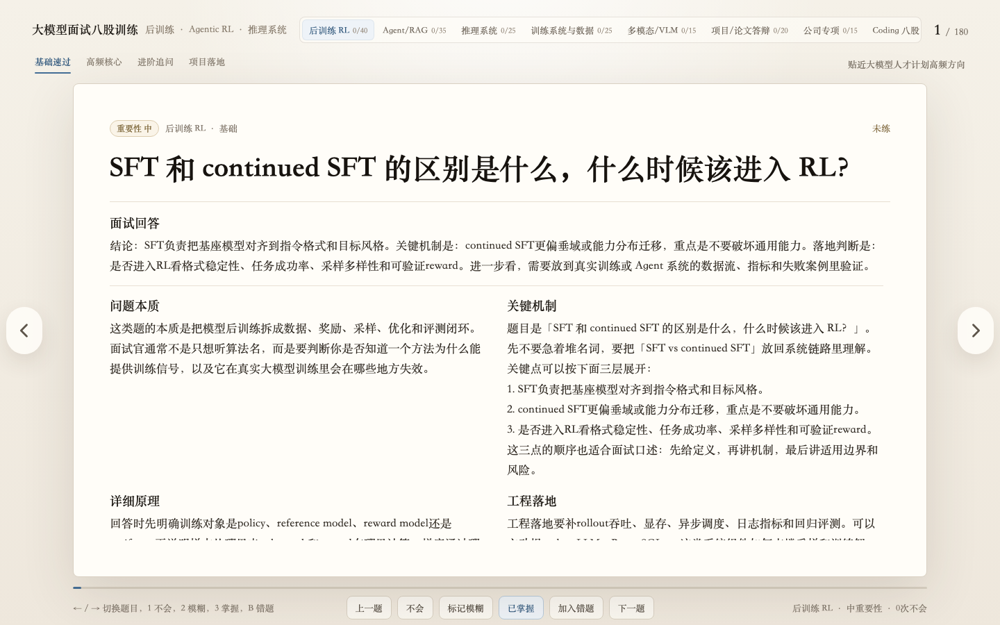

# LLM Interview Questions 180

大模型面试八股训练页，面向国内 AI 人才计划实习和大模型算法/后训练/Agent 方向面试准备。

页面是单文件静态应用，无需后端、无需构建，直接打开 `index.html` 即可使用。



## 内容覆盖

- 后训练/RL：SFT、RLHF、PPO、DPO、GRPO、DAPO、RLVR、reward hacking、KL、entropy collapse
- Agent/RAG：RAG、tool calling、MCP、function calling、memory、harness、多智能体、GUI Agent、自进化
- 推理系统：MHA、KV cache、GQA/MQA、vLLM、PagedAttention、FlashAttention、speculative decoding、长上下文
- 训练系统与数据：显存估算、ZeRO/FSDP/DeepSpeed、LoRA/QLoRA、数据配比、合成数据、benchmark 污染
- 多模态/VLM：LLaVA、CLIP、VQ-VAE、Diffusion、vision tower、视频理解、多模态后训练
- 项目/论文答辩：motivation、cost、ablation、failure case、业务落地、GM 答辩
- 公司专项：腾讯青云、字节 Seed、Kimi、DeepSeek、智谱 GLM、小米 MiMo、美团 LongCat、阿里 Qwen 等
- Coding 八股：MHA、top-p sampling、GRPO trainer、sampler、常见 DP

## 使用方式

本地直接打开：

```bash
open index.html
```

或者启动任意静态服务器：

```bash
python3 -m http.server 8000
```

然后访问：

```text
http://localhost:8000
```

## 训练方式

- 左右箭头或底部按钮切换题目
- 顶部导航切换主题
- 重要性导航按基础必过、高频核心、进阶追问、项目落地过滤
- 每页融合展示题目、面试回答、问题本质、关键机制、详细原理、工程落地、评测风险和来源
- 本地状态通过 `localStorage` 保存，刷新后仍保留掌握状态和错题记录

快捷键：

- `←` / `→`：切换题目
- `1`：不会
- `2`：模糊
- `3`：掌握
- `B`：加入错题

## 来源校准

题库答案使用面经总结发现高频问法，并用论文、官方文档和框架文档校准技术细节。覆盖来源包括：

- InstructGPT / RLHF
- Direct Preference Optimization
- DeepSeekMath / GRPO
- DAPO
- Retrieval-Augmented Generation
- ReAct / Toolformer / MCP
- PagedAttention / vLLM
- FlashAttention
- LoRA / QLoRA
- ZeRO / DeepSpeed
- LLaVA / CLIP / VQ-VAE / DDPM
- Kimi K2、DeepSeek-V3/R1、MiMo、GLM-4.5、Qwen2.5 等公开技术报告

## 文件结构

```text
.
├── index.html
├── README.md
├── talent_plan_internship_interview_50_report.html
└── assets
    └── screenshot.png
```

## 说明

这是面试训练工具，不是论文综述。公开面经只用于总结问法和流程，标准答案优先以论文、官方文档和可复现实现为准。
